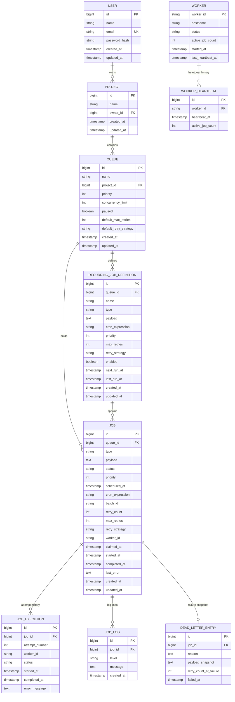

# Codity Assignment
## Build Instructions

1. **Install Docker**
   - Download and install Docker Desktop from the official Docker website.
   - Verify the installation:
     ```bash
     docker --version
     docker compose version
     ```

2. **Clone the Repository**
   ```bash
   git clone https://github.com/Ayushkr3/Codity
3. **Navigate to the Project Directory**
    ```bash 
    cd Codity
5. **Start the Application**
    ```bash
    docker compose up
7. **Access the Application**
    Once the containers are running, open your web browser and navigate to:
    ```bash
    http://localhost:8080/index.html

## Architecture

### Overview

This is a multi-tenant distributed job scheduler built on Spring Boot + PostgreSQL.
Users own projects, projects own queues, and queues hold jobs. A pool of worker
processes (each is just an instance of this same application) polls for work,
executes it, retries on failure with backoff, and moves permanently-failed jobs to
a dead letter queue.

```
User ──< Project ──< Queue ──< Job ──< JobExecution (one row per attempt)
                        │        └──< JobLog (structured log lines per job)
                        └──< RecurringJobDefinition (cron template → spawns Jobs)

Worker ──< WorkerHeartbeat (append-only heartbeat history)
Job ──1:1── DeadLetterEntry (created when a job exhausts its retries)
```
### Request flow (creating and running a job)

1. **Enqueue** — `POST /api/queues/{queueId}/jobs` validates the queue isn't
   paused, builds a `Job` row (`QUEUED` for immediate jobs, `SCHEDULED` if a delay/
   `atTime`/cron was given), and persists it.
2. **Promote** — `JobPromoter` runs every second and flips any `SCHEDULED` job
   whose `scheduledAt` has passed to `QUEUED`.
3. **Claim** — `JobPoller` runs every 500ms and calls
   `JobRepository.claimNextJobIds`, a native `UPDATE ... WHERE id IN (SELECT ...
   FOR UPDATE SKIP LOCKED)` query. This is what makes claiming atomic across
   multiple worker instances: two workers polling at the same instant can never
   claim the same row, and neither blocks waiting on the other's lock.
4. **Execute** — Claimed jobs are handed to `JobExecutor`, which runs them on a
   fixed thread pool, dispatching by `job.type` to a registered `JobHandler` bean.
   Each attempt gets a `JobExecution` row and `JobLog` entries.
5. **Retry / dead-letter** — On failure, `RetryPolicy` computes a backoff delay
   based on the job's `retryStrategy` (`FIXED` / `LINEAR` / `EXPONENTIAL`) and the
   job goes back to `SCHEDULED`. Once `retryCount >= maxRetries`, the job moves to
   `DEAD\_LETTER` and a `DeadLetterEntry` snapshot is written.
6. **Recurring jobs** — `RecurringJobScheduler` runs every minute, finds
   `RecurringJobDefinition` rows whose `nextRunAt` has passed, spawns a concrete
   `Job`, and advances `nextRunAt` using Spring's `CronExpression`.
7. **Self-healing** — `StaleJobReclaimer` runs every 15s. Jobs stuck `RUNNING` for
   >10 minutes, or stuck `CLAIMED` for >30s without ever starting (worker died
   right after claiming), are requeued. Workers that haven't heartbeat in 30s are
   marked `STOPPED`.

### Concurrency & reliability

- **Atomic claiming**: `SELECT ... FOR UPDATE SKIP LOCKED` (see above) — the core
  guarantee that no two workers execute the same job concurrently.
- **Per-queue concurrency limit**: `Queue.concurrencyLimit` is modeled but not yet
  enforced by the claim query (see `docs/design-decisions.md` for what's next).
- **Graceful shutdown**: `JobExecutor` stops accepting new work and waits (up to
  30s) for in-flight jobs to finish on `@PreDestroy`, so a rolling deploy doesn't
  silently orphan running work; anything still in-flight past that gets reclaimed
  by `StaleJobReclaimer` on the next worker.
- **Idempotent handlers assumed**: since a crash between "job completed" and "row
  updated" is possible, handlers should be written to be safe to run twice.

### Multi-tenancy

Every queue/job read or write goes through an ownership check
(`QueueService.getOwnedQueue` / `assertOwnership`) that walks `Queue → Project →
User` and compares against the JWT-authenticated user id, so one tenant can't see
or act on another tenant's jobs.

### Package layout

```
entity/       JPA entities (one table each)
repository/   Spring Data repositories, including native/JPQL queries
service/      Business logic, ownership checks, DTO mapping
controller/   REST endpoints (thin — delegate to services)
dispatcher/   The scheduler engine itself (poller, executor, promoter,
              recurring-job scheduler, stale-job reclaimer)
dto/          Request/response shapes
enums/        JobStatus, RetryMethods, WorkerStatus
security/     JWT issuing/validation, Spring Security filter chain
util/         RetryPolicy (backoff math), CronUtils (cron parsing)
handler/      JobHandler interface — implement this + register a bean named after
              the job `type` to add new kinds of work
```

# Data Model / ER Diagram



## Notes on design choices

- **`JOB` carries both live state and denormalized retry config** (`retry_count`,
  `max_retries`, `retry_strategy`) rather than always joining back to `Queue` for
  defaults. Values are copied from the queue's defaults at creation time, so
  changing a queue's default retry policy later doesn't retroactively change
  already-enqueued jobs — matches how most schedulers (Sidekiq, Celery, BullMQ)
  behave.
- **`JOB_EXECUTION` is separate from `JOB`** so full attempt-by-attempt history
  survives even after the job's own `retry_count`/`status` move on. `JOB` alone can
  only tell you the *current* state; `JOB_EXECUTION` tells you the whole story.
- **`DEAD_LETTER_ENTRY` is a 1:1 snapshot, not just a status flag**, so the failure
  reason/payload at the moment of dead-lettering is preserved even if the job is
  later edited or requeued.
- **`WORKER` (current state) vs `WORKER_HEARTBEAT` (history)** mirrors the
  `JOB`/`JOB_EXECUTION` split for the same reason: O(1) "is this worker alive right
  now" lookups without scanning history, but the history is still there for uptime
  charts.


## Design Decisions & Known Limitations

### Why `SELECT ... FOR UPDATE SKIP LOCKED` for claiming

This is the one piece of the original code that was already right, and everything
added builds around it rather than replacing it. Alternatives considered:

- **Optimistic locking (`@Version` + retry loop)**: works, but under contention
  (many workers polling the same queue) you get a lot of wasted retries as workers
  collide on the same rows.
- **A distributed lock (Redis/ZooKeeper) per job**: adds an external dependency and
  a second source of truth to keep in sync with the DB row.
- **`FOR UPDATE SKIP LOCKED`**: lets Postgres itself guarantee at most one worker
  gets each row, with no collisions and no extra infrastructure — the tradeoff is
  it's Postgres-specific (the native query would need rewriting for MySQL/etc).

### Why retry config is copied onto `Job` at creation time

`maxRetries` and `retryStrategy` are read from the queue's defaults when a job is
created and stored on the job row itself, rather than always joining to `Queue`.
This means changing a queue's default retry policy only affects jobs created after
the change — already-enqueued jobs keep the policy they were created with. This
matches the behavior of most production job queues and avoids surprising
in-flight jobs with a policy change mid-flight.

### Why dead-letter is both a status AND a separate table

`Job.status = DEAD\_LETTER` is enough for filtering/queries, but a `DeadLetterEntry`
row also exists so the failure reason and payload are frozen at the moment of
failure. If the job is later requeued and re-fails differently, the original
failure snapshot isn't overwritten.


### Testing

Unit tests cover the two pieces of pure logic that are easiest to get subtly wrong
and hardest to eyeball-verify: `RetryPolicy` (backoff math for all three
strategies, including the max-delay cap) and `CronUtils` (cron validation and
next-run computation). Repository/service/controller layers would benefit from
`@DataJpaTest` and `@WebMvcTest` coverage next — not included here since they need
a real Postgres instance (or Testcontainers) to be meaningful, which wasn't
available in this environment.


### API Reference

All endpoints except `/api/auth/\*\*` require a `Authorization: Bearer <token>`
header (obtained from `/api/auth/login` or `/api/auth/register`).

### Auth

| Method | Path | Body | Notes |
|---|---|---|---|
| POST | `/api/auth/register` | `{name, email, password}` | Also provisions a default project + default queue |
| POST | `/api/auth/login` | `{email, password}` | |

### Projects

| Method | Path | Body |
|---|---|---|
| GET | `/api/projects` | — |
| POST | `/api/projects` | `{name}` |

### Queues

| Method | Path | Body |
|---|---|---|
| POST | `/api/projects/{projectId}/queues` | `{name, priority?, concurrencyLimit?, defaultMaxRetries?, defaultRetryStrategy?}` |
| GET | `/api/projects/{projectId}/queues` | — |
| GET | `/api/queues/{queueId}` | — (includes live job counts by status) |
| PATCH | `/api/queues/{queueId}` | any subset of the create fields |
| POST | `/api/queues/{queueId}/pause` | — |
| POST | `/api/queues/{queueId}/resume` | — |
| GET | `/api/queues/{queueId}/stats` | — (alias of GET queue) |

### Jobs

| Method | Path | Body / Params |
|---|---|---|
| POST | `/api/queues/{queueId}/jobs` | `{type, payLoad, priority?, delaySecond? \\| atTime? \\| cronExp?, maxRetries?, retryStrategy?}` |
| POST | `/api/queues/{queueId}/jobs/batch` | `{jobs: \[ ...same shape as above... ]}` |
| GET | `/api/queues/{queueId}/jobs` | `?status=QUEUED\&page=0\&size=20` |
| GET | `/api/queues/{queueId}/jobs/{jobId}` | — |
| POST | `/api/queues/{queueId}/jobs/{jobId}/retry` | — (only for FAILED / DEAD_LETTER jobs) |
| DELETE | `/api/queues/{queueId}/jobs/{jobId}` | — (only for QUEUED / SCHEDULED jobs) |
| GET | `/api/queues/{queueId}/jobs/{jobId}/logs` | — |
| GET | `/api/queues/{queueId}/jobs/{jobId}/executions` | — attempt-by-attempt history |

Exactly one of `delaySecond` (seconds from now), `atTime` (ISO-8601 instant), or
`cronExp` may be set for a delayed/scheduled job; omit all three for immediate
execution. Note: `cronExp` on a single job is a one-off scheduling hint, not a
recurring schedule — for actual recurring jobs use the recurring-jobs endpoints
below.

### Recurring jobs

| Method | Path | Body |
|---|---|---|
| POST | `/api/queues/{queueId}/recurring-jobs` | `{name, type, payload?, cronExpression, priority?, maxRetries?, retryStrategy?}` |
| GET | `/api/queues/{queueId}/recurring-jobs` | — |
| POST | `/api/queues/{queueId}/recurring-jobs/{id}/pause` | — |
| POST | `/api/queues/{queueId}/recurring-jobs/{id}/resume` | — |

`cronExpression` uses Spring's 6-field cron syntax: `second minute hour
day-of-month month day-of-week`, e.g. `0 0/5 * * * *` = every 5 minutes.

### Dead letter queue

| Method | Path | Notes |
|---|---|---|
| GET | `/api/dlq` | Paginated, most recent failures first |
| POST | `/api/dlq/{id}/requeue` | Resets retry count and puts the job back in QUEUED |

### Workers

| Method | Path | Notes |
|---|---|---|
| GET | `/api/workers` | Live status, active job count, last heartbeat per worker process |

### Errors

All errors return:

```json
{
  "timestamp": "2026-07-03T10:15:30Z",
  "status": 404,
  "error": "Not Found",
  "message": "Job not found"
}
```
`IllegalArgumentException` → 404, `IllegalStateException` → 409 (e.g. "queue is
paused", "only FAILED/DEAD_LETTER jobs can be retried"), validation errors → 400,
ownership violations → 403.
